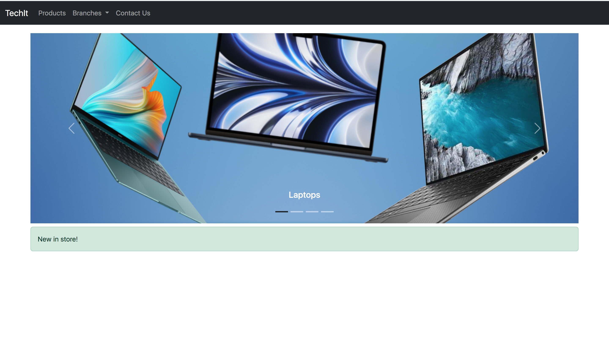
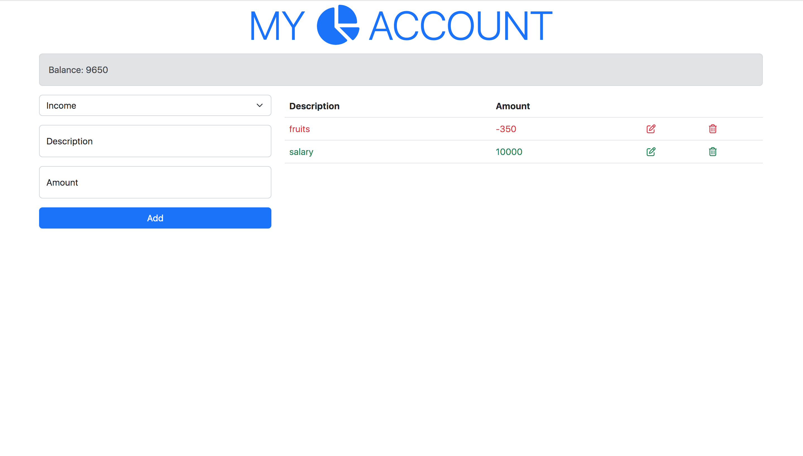
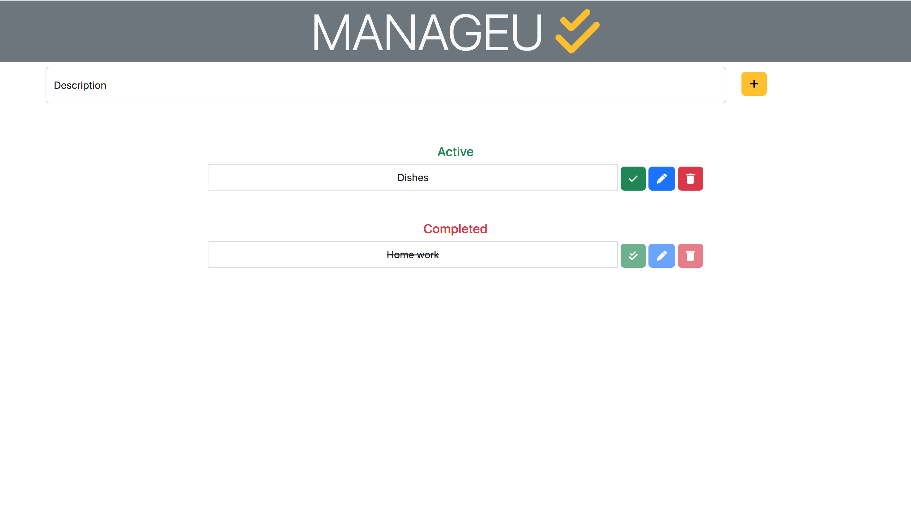

# My Portfolio README

## Introduction
Hello! I'm Matanel Chouraqoui, a web developer passionate about building user-friendly and performant web applications. Welcome to my portfolio, where I showcase some of my best projects.

## Portfolio Overview
My portfolio includes a mix of personal projects and client work. It covers front-end development, back-end development, and some design work. Each project represents a unique challenge and highlights my skills and growth as a developer.

## Screenshots

## Project Descriptions
### Project 1 - Project TechIt 
- Description: This project is a full-stack web application that allows users to have an acceses to a store. in this project you can see a store demo of electrice product
- Technologies used: HTML, CSS, JavaScript.
- Live Demo: [Link to the live demo](http://127.0.0.1:5500/My-Work/PROJECT%201/mini_p_1.html)

### Project 2 - Project My Acount 
- Description: This project is a full-stack web application that allows users to manage theyre acaount by 
seeing all the incomes and outcomes
- Technologies used:  HTML, CSS, JavaScript.
- Live Demo: [Link to the live demo](http://127.0.0.1:5500/My-Work/PROJECT%202/index.html)

### Project 3 - Project MANAGEU
- Description: This project is a full-stack web application that allows users to manage theyre day tasks
- Technologies used:  HTML, CSS, JavaScript, TypeScript, Node.js.
- Live Demo: [Link to the live demo](http://127.0.0.1:5500/My-Work/PROJECT%203/project_2_index.html)

## Contact
Feel free to reach out to me via email at [matanelshouraki770@gmail.com] or visit my portfolio website at [http://127.0.0.1:5500/index.html].

## License
All code in this repository is licensed under the [MIT License].
